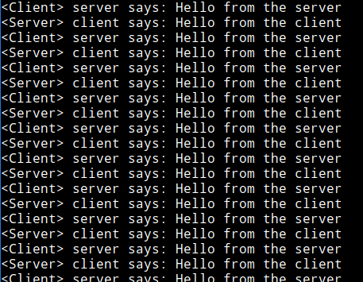

# user_net

user_net is a toy userspace linux networking stack written completely in Rust. 

## Why?
I've recently finished this fantastic course on computer networking and thought it'd be a fun exercise to put together everything I learnt into practice.  
[https://www.youtube.com/playlist?list=PLEAYkSg4uSQ2dr0XO_Nwa5OcdEcaaELSG]

Also, being a full time back-end web developer writing mostly Ruby, I've always wanted to master this arcane art of "systems programming". 

## Improvements

As someone who has just started out doing systems programming(and Rust :D), I'm pretty confident that I've made some pretty nasty mistakes and gone along with some bad design patterns. So pull requests are always welcome.

## TODO
- IP packet fragmenting
- TCP/IP
- Add unit tests and integration tests
- Tons of otherstuff :D

## Whats working right now?
- ARP request and reply
- ICMP echo replies
- UDP client and server
- Loopback behaviour

## [Examples](examples)

### UDP

A simple UDP client server is shown below. 
```
use user_net;
use std::thread;

fn main() {
    user_net::start_stack();
    std::thread::spawn(|| {
        start_client()
    });
    start_server()
}

fn start_server() {
    let server = user_net::udp_socket::bind("10.0.0.2:5055").unwrap();
    let bytes = "Hello from the server".as_bytes();
    loop {
        let mut buf = Vec::with_capacity(1000);
        let (num_bytes, from) = server.recv_from(&mut buf).unwrap();
        println!("<Server> client says: {}", std::str::from_utf8(&buf).unwrap());
        server.send_to(bytes, &from);
    }
}


fn start_client() {
    let client = user_net::udp_socket::bind("10.0.0.2:4055").unwrap();
    client.connect("10.0.0.2:5055").unwrap();
    let bytes = "Hello from the client".as_bytes();
    loop{
        let mut buf = Vec::with_capacity(1000);
        client.send(bytes).unwrap();
        client.recv_from(&mut buf).unwrap();
        println!("<Client> server says: {}", std::str::from_utf8(&buf).unwrap());
    }
}

```



# Reference works 
* [TUN/TAP device](https://backreference.org/2010/03/26/tuntap-interface-tutorial/)
* level-ip, [source code](https://github.com/saminiir/level-ip)

